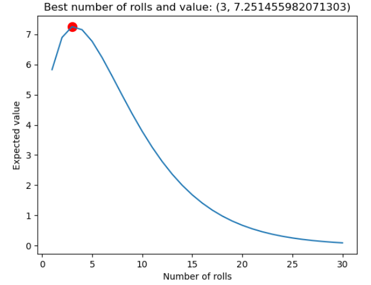

# Pass the Pigs: Statistical Modeling

## Overview

This repository contains a Jupyter Notebook that explores statistical models to optimize player strategies in "Pass the Pigs", inspired by a discussion on the popular YouTube channel, Numberphile.
The Game

In "Pass the Pigs", players toss two pigs, and the landing positions determine their score. Points are accumulated in an attempt to reach exactly 100. If the pigs land in a position that scores zero points (an "oinker"), all points for that turn are lost. Similarly, exceeding 100 points results in losing all points gained in that round. The game combines elements of luck, risk, and strategy.

# Models

## Model 1: Optimal Number of Rolls

This model calculates the optimal number of times a player should roll the pigs within a single turn. The formula used is:

E(total score)=P(roll again)n×E(points)×nE(total score)=P(roll again)n×E(points)×n

where:

    P(roll again)P(roll again) is the probability that the pigs do not land as 'Side (no dot)' and 'Side (dot)', which would score zero points.
    E(points)E(points) is the expected score per roll, calculated as the average of the points scored, weighted by the probability of each landing position.

## Model 2: Optimal Score Target Before Passing

This model determines the optimal score a player should aim for before deciding to pass the pigs to the next player. The critical equation is:

x=P(roll again)×E(expected)1−P(roll again)x=1−P(roll again)P(roll again)×E(expected)​

where:

    xx is the score at which the expected gain from an additional roll would be outweighed by the risk of losing points.

